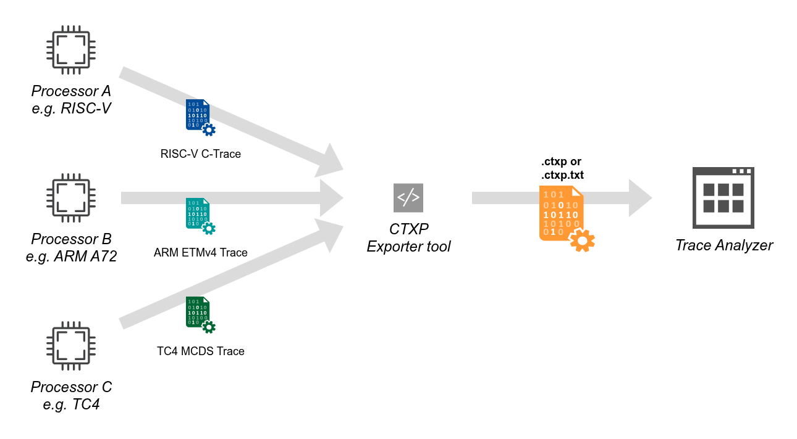
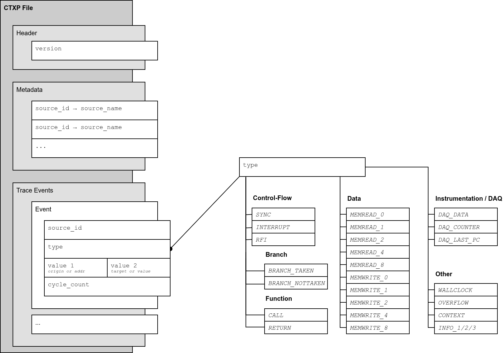
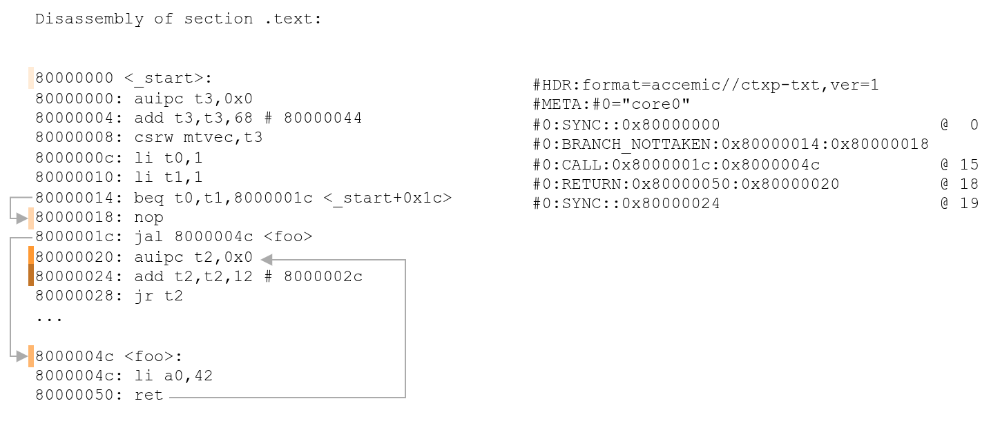
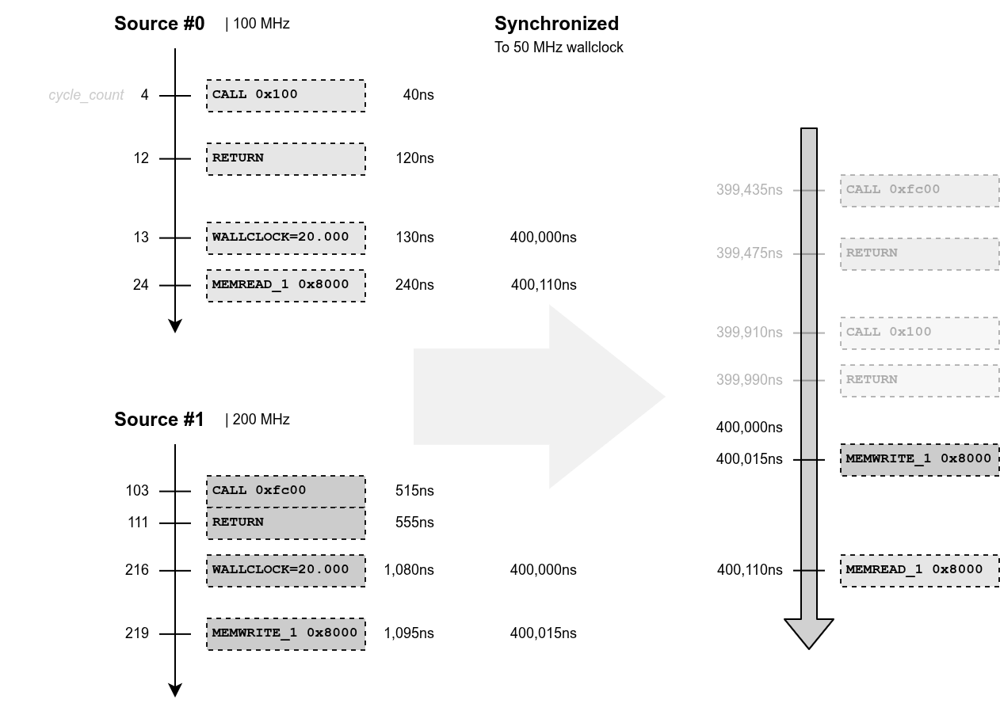

= C-Trace eXPort (CTXP) - File Format Specification (PR8.18)
:toclevels: 3

== Introduction
The CTXP file format defines a unified format for processor trace data: control-flow events, memory accesses, and timing information from a single multi-core system. This document describes file version 1.

In principle, the format lifts native bit-compressed hardware traces like RISC-V C-Trace, ARM CoreSight ETMv4 or TriCore MCDS, etc. into a uniform byte-level event stream, that is easier to digest for trace analyzers. Although similar vendor-specific formats exist, no public available format has yet been defined, unlike the CTXP format.

.CTXP format provides a unified input for trace analyzers.

*Key Features:*

* Multiple trace sources (up to 256)
* Represent control-flow events (branches, calls, returns, interrupts, return-from-interrupt)
* Control-flow has 2 modes: function trace and branch trace
* Represents memory accesses (reads/writes of 0 (address only), 1, 2, 4, or 8 bytes with address & value)
* Trace-local per-core cycle timestamp for precise timing (optional)
* Optional global timestamp markers for cross-source correlation
* Dual representations: binary (.ctxp) and text (.ctxp.txt)
* Easily processable, grep-able text format, understandable by humans

Typical use cases for trace analyzers include post-mortem debugging, performance profiling, and visual analysis. These tasks involve various processing steps such as converting CTXP addresses into symbols and source code locations, performing cross-source synchronization, or even aligning trace data with other system events.

*Important Remarks:*

* The set of recorded events depends entirely on the trace configuration of the target system.
* When speaking of "instruction address", it means the first byte associated with the instruction.

== Data Model & Semantics

The data model is equal for text and binary encoding.

.Each field in the data model has a defined type.
[%header]
|===
| Field         | Type            | Value | Description
| `version`     | 16 bit unsigned | 0x1   | 1 = Initial Version
| `source_id`   | 8 bit unsigned  |       | Numeric identifier of which trace source emitted the event.
| `source_name` | UTF8 string     |       | Text description for `source_id`. Maximum 1024 bytes.
| `type`        | 8 bit enum      |       | Event type. Defines semantics of `value 1` and `value 2`.
| `value 1/2`   | 64 bit          |       | Event payload. See details in section <<sec:trace_events>> about exact semantics per `type`.
| `cycle_count` | 64 bit unsigned |       | Absolute source-local, monotonic cycle count. Optional. Does not wrap. `OVERFLOW` events resets the count.
|===

[[tab:type_payloads]]
.The event type defines the validity of the two payload fields, and their basic semantics.
[%header]
|===
| Type            | Payload Value 1 | Payload Value 2
| SYNC            |                 | `target`
| BRANCH_TAKEN    | `origin`        | `target`
| BRANCH_NOTTAKEN | `origin`        | `target`
| CALL            | `origin`        | `target`
| RETURN          | `origin`        | `target`
| INTERRUPT       | `origin`        | `target`
| RFI             | `origin`        | `target`
| MEMWRITE_0      | `addr`          |
| MEMWRITE_1      | `addr` (opt.)   | `value`
| MEMWRITE_2      | `addr` (opt.)   | `value`
| MEMWRITE_4      | `addr` (opt.)   | `value`
| MEMWRITE_8      | `addr` (opt.)   | `value`
| MEMREAD_0       | `addr`          |
| MEMREAD_1       | `addr` (opt.)   | `value`
| MEMREAD_2       | `addr` (opt.)   | `value`
| MEMREAD_4       | `addr` (opt.)   | `value`
| MEMREAD_8       | `addr` (opt.)   | `value`
| OVERFLOW        |                 |
| CONTEXT         |                 | `value`
| WALLCLOCK       |                 | `value`
| DAQ_DATA        |                 | `tag`
| DAQ_COUNTER     | `count`         | `kind, region, tag`
| DAQ_LAST_PC     |                 | `prev_pc`
|===

=== Metadata

* Map of human-readable names for decimal-encoded source ids, in the form
** Source Id → Source name (byte to string)
* A source name must not be given for every source id.
* A source id should not appear twice in the map.

[[sec:trace_events]]
== Trace Events

*Event Ordering*
Events are ordered chronologically per source by `cycle_count`.
When multiple sources are interleaved, their relative order is undefined unless `WALLCLOCK` synchronization points are present. If no `cycle_count` is given, the order still follows the order of their appearance in the trace-event section. Anyhow, events might have happened simultaneously.

=== Control-Flow Events

Control-flow events allow to trace back, which code a CPU core executed. In principle, the instruction trace is *continuous*, meaning that intra-event points can be inferred from looking at two events. Only `OVERFLOW` events create a discontinuity. In the special case of function-only traces, fine-grained branch information cannot be inferred by the subsequent trace analyzer.

SYNC:: Core with `source_id` reached instruction at `target` address. Typically the first control-flow related event setting the starting point of the trace. Might also deliver additional support points for timing information. For example - as `BRANCH_TAKEN` events only carry timing about when `target` got reached, an additional `SYNC` could give the time the actual branch instruction was reached. The optional `cycle_count` specifies when `target` got reached.

INTERRUPT:: Core with `source_id` reached `target` address because of an interrupt. The last known instruction address that got executed, or at least tried to be executed (for example for invalid-opcode) before the interrupt is given by `origin`, and the next known address `target` is the instruction where the core continues. The optional `cycle_count` specifies when `target` got reached.

RFI:: Short for return-from-interrupt. CPU came back from an interrupt. The of last known executed instruction address is given at `origin`, and the first known instruction address where the CPU continues is `target`.

BRANCH_TAKEN:: Core with `source_id` reached `target` address after taking a branch instruction. All types of branches are considered - may they be conditional, unconditional, direct or indirect, *except for calls & returns* (see `CALL`/`RETURN`). `origin` is the address of the branch instruction, while `target` is the destination of the branch instruction. The optional `cycle_count` specifies when `target` got reached.

BRANCH_NOTTAKEN:: Core with `source_id` reached `target` address after skipping a conditional branch (may it be direct or indirect). `origin` is the address of the branch instruction, and `target` the address of the reached instruction directly after the skipped branch. The optional `cycle_count` specifies when `target` got reached.

CALL:: Core with `source_id` reached `target` address by a call instruction. `origin` is the callers instruction address. The optional `cycle_count` specifies when `target` got reached.

RETURN:: Core with `source_id` reached `target` after executing a return instruction. `origin` represents the instruction address of the return. The optional `cycle_count` specifies when `target` got reached.

=== Data Events

MEMREAD_0/MEMWRITE_0:: Source with `source_id` finished a read/write access to address `addr` of unknown size and data. No actual data is logged. The optional `cycle_count` specifies when the transaction finished.

MEMREAD_1,2,4,8:: Source with `source_id` performed a read access at `address`, with `value`. Could be 1, 2, 4 or 8 bytes size. The endianness of `value` fields follows the endianness of the traced target. The optional `cycle_count` specifies when the transaction finished.

MEMWRITE_1,2,4,8:: Source with `source_id` performed a write access to `address`, with `value`. Could be 1, 2, 4 or 8 bytes size. The endianness of `value` fields follows the endianness of the traced target. The optional `cycle_count` specifies when the transaction finished.

NOTE: For the sized accesses (`MEMREAD_1,2,4,8` / `MEMWRITE_1,2,4,8`) the `address` is *optional*. When the access value is known but its address is not (for example a value-only data capture), the address is omitted: in the text encoding `value 1` is left empty (`#0:MEMWRITE_4::0x...`), and in the binary encoding `addr` carries the reserved sentinel `0xFFFFFFFFFFFFFFFF`. Consequently an access at the all-ones address cannot be represented as "address present". `MEMREAD_0`/`MEMWRITE_0` are unaffected — they always carry an address and no value.

=== Other Events - Overflows, Timestamps, etc.

OVERFLOW:: Signals the source-local trace buffer wrapped or lost events for `source_id`. Source's `cycle_count` of following events will restart from zero. Decoder must totally reset its current state of the affected source.

CONTEXT:: Indicates a new context or task of the CPU core with `source_id`. New context identifier is given in `value`. The semantics of the identifier is defined by the native trace protocol, and is typically a task id. The subsequent decoder might use this event to analyze the current tasks. For processors with virtual address space, a new context might also result in a change of the related program binary.

WALLCLOCK:: Global, cross-source available timestamp update to `value`. The optional `cycle_count` sets the relation to the source-local time.

INFO_1,2,3:: Unspecified, user-defined events. Allow flexibility by exporter and analyzer, and shall be gently ignored by all parsers. May carry optional `cycle_count` indicating when the event occurred.

=== Instrumentation / DAQ Events

These events represent *user-generated* trace data: messages emitted on demand when a user-configured watchpoint/trigger fires (for example C-Trace's ACT-CAP / ACT-ST facility). Unlike `INFO_*`, they carry semantically meaningful data that a decoder is expected to keep. Most native instrumentation messages map onto existing CTXP events (`SYNC`, `MEMREAD`/`MEMWRITE`, ...); the three events below cover what no existing event can express. The full native-to-CTXP mapping is given in <<sec:export_native>>.

DAQ_DATA:: A user-supplied opaque tag (`DirectData`) attached to the event it qualifies, delivered in `value 2` (24 bits). It carries nothing else: a captured data *value* is expressed as a `MEMREAD`/`MEMWRITE` (address omitted when only the value is known), so its size and read/write direction already live in the memory event's type and need not be repeated here.

DAQ_COUNTER:: A performance/threshold counter readout. `value 1` holds the counter value. `value 2` packs `[20:19]` = counter kind (0 = instruction-fetch-threshold, 1 = data-read-threshold, 2 = data-write, 3 = data-read), `[18:16]` = region index, `[15:0]` = user tag. The counter is typically reset by the hardware after the readout.

DAQ_LAST_PC:: The last instruction address executed before an exception/interrupt, delivered in `value 2`. Used together with a following `SYNC` to report both the current PC and the pre-trap PC.

*Ordering.* `DAQ_DATA` and `DAQ_LAST_PC` are *supplementary* events: an exporter emits them *immediately before* the event they qualify ("the triggered event"), on the same `source_id` with the same `cycle_count`. A decoder reads them as qualifiers of the event that follows.

*Timing.* Because instrumentation messages are emitted when their trigger fires, a DAQ event's `cycle_count` is the trigger/emission time. Data accesses that trigger on the access itself (mapped to `MEMREAD`/`MEMWRITE`) therefore carry the access time, whereas a `DAQ_LAST_PC` value is retrospective (an instruction that retired before the trigger).

== Text Encoding (.ctxp.txt)

The text representation of CTXP-files is mainly for human interaction, but is also machine-readable. CTXP text files must use UTF8-no-BOM encoding. Line breaks must be LF.

- First line must be the header with version:
+
[source]
HDR:format=accemic//ctxp-txt,ver=1

- The metadata section must follow the following example format. Source names must be quoted. Source names containing a quote-symbol `"` must escape the symbol with a backslash `\` like `\"`. Backslashs must be escaped with another preceding backslash like `\\`. Source ids are decimal.
+
[source]
META:#0="CPU0",#1="CPU1",#2="CPU2",#3="CPU\\\"3\""

- Followed by the trace data, as list of events in each line:
+
[source]
#<SOURCE ID:dec>:<TYPE:string>:(<VALUE 1:hex>)?:(<VALUE 2:hex>)?: (@ <CYCLE COUNT:dec>)?

** `TYPE:string` must be a type defined in <<sec:trace_events>>.
** Presence of `VALUE 1` and `VALUE 2` depend on `TYPE`, defined in <<tab:type_payloads>>. Colons are always present.
** `CYCLE_COUNT` is optional, and indicated by `@` at the last part of the line.
** To improve readability, whitespaces (space and tab) are allowed between the elements, so parsers so gently skip them.
** Hex-values must have `0x` prefix, are lower-case, and can contain preceding zeros, so they have a variable length.

..ctxp.txt example with explanation:
[source]
----
HDR:format=accemic//ctxp-txt,ver=1
META:#0="CPU0",#1="CPU1"
#0:SYNC::0x80000000                      @  0      <1>
#0:BRANCH_NOTTAKEN:0x80003ca2:0x80003ca6 @  4      <2>
#1:MEMREAD_1:0x70000064:0x00             @  1      <3>
#0:WALLCLOCK::0x12000                    @ 10      <4>
#1:WALLCLOCK::0x12000                    @  4      <5>
#0:BRANCH_TAKEN:0x80003d00:0x8000298c    @ 24      <6>
----

<1> Core 0 currently at PC 0x80000000, cycle=0
<2> Core 0, non-taken branch at 0x80003ca2 was skipped, and continue with 0x80003CA6, cycle=4
<3> Another core, CPU1, performed a 1-byte read at addr=0x70000064, value=0x0, cycle=1
<4> Global timestamp is now 73728 (0x12000), at CPU0 cycles=10
<5> Global timestamp is now 73728 (0x12000), at CPU1 cycles=4
<6> Core 0, taken branch at 0x80003d00 was taken to PC 0x8000298C, cycles=24

== Binary Encoding (.ctxp)

The binary encoding aims to provide a fast machine-consumption of the trace.

- All multi-byte values are little endian.

=== Header Encoding

The .ctxp file starts with a fixed-size header:

.Header Section
[cols="1,1,4",options="header"]
|===
| Field       | Size (bytes) | Description
| Magic       | 4            | ASCII string `"CTXP"` (0x43 0x54 0x58 0x50)
| HeaderSize  | 2            | Length of this header in bytes (for v1: 8)
| Version     | 2            | File format version (for v1: 1)
|===

.Example .ctxp Header (hex dump)
----
43 54 58 50 08 00 01 00
CTXP         8       v1
----

=== Metadata Encoding

[cols="1,1,4",options="header"]
|===
| Field         | Size (bytes)         | Description
| SectionType   | 2 (LE)               | Section identifier (`0x0001` for metadata)
| SectionLength | 2 (LE)               | Total section length in bytes, including starting from SectionType
| Payload       | value(SectionLength) | List of entries
| > SourceId    | 1                    | Numeric source identifier
| > NameLen     | 1                    | Length of name string in bytes (UTF-8)
| > Name        | NameLen              | UTF-8 encoded string (without terminator)
|===

.Example (full metadata section with one entry)
----
01 00                              ; SectionType = 1 (metadata)
11 00                              ; SectionLength = 17 bytes
01 09 63 6F 72 65 5F 63 70 75 30   ; id=1, "core_cpu0"
----

=== Event Encoding

* TraceEvents are packed to exactly 26 bytes each. Events are tightly packed, with no padding between entries.
* Multi-byte values are in general little-endian, except for `data.value`, which endianness depends on target architecture.

[source,c]
----
typedef struct attribute((packed)) {
	uint8_t      source_id;
	EventType    type;         // See enum below.
	union {
		struct { uint64_t origin, target; }  instr;
		struct { uint64_t addr,   value;  }  data;
	} payload;
	uint64_t        cycle_count;  // Optional. Valid if MSB of type is set.
} TraceEvent;

enum class EventType : uint8_t
{
    // CPU control flow
    SYNC                           = 0b0'000'0000,
    SYNC_WITH_TIMESTAMP            = 0b1'000'0000,
    BRANCH_TAKEN                   = 0b0'001'0001,
    BRANCH_TAKEN_WITH_TIMESTAMP    = 0b1'001'0001,
    BRANCH_NOTTAKEN                = 0b0'001'0010,
    BRANCH_NOTTAKEN_WITH_TIMESTAMP = 0b1'001'0010,
    INTERRUPT                      = 0b0'001'0011,
    INTERRUPT_WITH_TIMESTAMP       = 0b1'001'0011,
    RFI                            = 0b0'001'0101,
    RFI_WITH_TIMESTAMP             = 0b1'001'0101,
    CALL                           = 0b0'001'0110,
    CALL_WITH_TIMESTAMP            = 0b1'001'0110,
    RETURN                         = 0b0'001'0111,
    RETURN_WITH_TIMESTAMP          = 0b1'001'0111,

    // Memory write events
    MEMWRITE_0                = 0b0'010'0000,
    MEMWRITE_0_WITH_TIMESTAMP = 0b1'010'0000,
    MEMWRITE_1                = 0b0'010'0001,
    MEMWRITE_1_WITH_TIMESTAMP = 0b1'010'0001,
    MEMWRITE_2                = 0b0'010'0010,
    MEMWRITE_2_WITH_TIMESTAMP = 0b1'010'0010,
    MEMWRITE_4                = 0b0'010'0100,
    MEMWRITE_4_WITH_TIMESTAMP = 0b1'010'0100,
    MEMWRITE_8                = 0b0'010'1000,
    MEMWRITE_8_WITH_TIMESTAMP = 0b1'010'1000,

    // Memory read events
    MEMREAD_0                 = 0b0'011'0000,
    MEMREAD_0_WITH_TIMESTAMP  = 0b1'011'0000,
    MEMREAD_1                 = 0b0'011'0001,
    MEMREAD_1_WITH_TIMESTAMP  = 0b1'011'0001,
    MEMREAD_2                 = 0b0'011'0010,
    MEMREAD_2_WITH_TIMESTAMP  = 0b1'011'0010,
    MEMREAD_4                 = 0b0'011'0100,
    MEMREAD_4_WITH_TIMESTAMP  = 0b1'011'0100,
    MEMREAD_8                 = 0b0'011'1000,
    MEMREAD_8_WITH_TIMESTAMP  = 0b1'011'1000,

    // Trace control
    OVERFLOW                  = 0b0'101'1111,

    // Others
    CONTEXT                   = 0b0'100'0000,
    CONTEXT_WITH_TIMESTAMP    = 0b1'100'0000,
    WALLCLOCK                 = 0b0'100'0001,
    WALLCLOCK_WITH_TIMESTAMP  = 0b1'100'0001,

    // Instrumentation / DAQ
    DAQ_DATA                   = 0b0'110'0000,
    DAQ_DATA_WITH_TIMESTAMP    = 0b1'110'0000,
    DAQ_COUNTER                = 0b0'110'0001,
    DAQ_COUNTER_WITH_TIMESTAMP = 0b1'110'0001,
    DAQ_LAST_PC                = 0b0'110'0010,
    DAQ_LAST_PC_WITH_TIMESTAMP = 0b1'110'0010,

    // User-defined
    INFO1                     = 0b0'111'0000,
    INFO1_WITH_TIMESTAMP      = 0b1'111'0000,
    INFO2                     = 0b0'111'0001,
    INFO2_WITH_TIMESTAMP      = 0b1'111'0001,
    INFO3                     = 0b0'111'0010,
    INFO3_WITH_TIMESTAMP      = 0b1'111'0010
};
----

== Example

.The CTXP trace allows reconstructing the path taken through the example program by a single CPU core.

Explanation:

* Program reached `0x8000_0000` at time 0.
* Program took 15 clock cycles to reach `0x8000_004c` by a call, executing all instructions since, and including `0x8000_0000`, and including the nottaken branch at `0x8000_0014`, but without actually executing the `li a0,42` instruction at `0x8000_004c`.
* Program took 3 cycles to return to `0x8000_0020`.
* Program took 1 cycle to execute the `auipc t2,0x0` instruction at `0x8000_0020`, reaching `0x8000_0024`.

== Cross-source Synchronization

Cross-source synchronization is the process of bringing events from two or more sources to a global order, of what happened when.
The `WALLCLOCK` events serve as anchor for all sources. The associated `cycle_clock` defines the offset to each source timing.

.Cross-source synchronization allows to determine which events happened before others. Often, sources and wall clock run on different frequencies.

The following steps are required for the synchronization:

1. Convert all source `cycle_count` and `WALLCLOCK` values to a common base, like nanoseconds.
2. For each source, apply the `WALLCLOCK`'s `cycle_count` offset to all events.
3. Order all events from all sources on the global time value.

== Limitations / Future Ideas

* No dynamic frequency/power-state events
* Declare observed instruction address regions to support filtered traces. Could be implemented by defining a new section type.
* Include cycle-count frequencies for conversion. Could be implemented later through a global header or individual events.
* Traces are theoretically limited in time by the 64-bit `cycle_count` to around 500 years length (CPU clock of 1 GHz).

== Practical Tips for Tool Developers

* Prefer compressed .ctxp files (e.g. ZIP) to reduce disk size.
* Unknown format versions must be rejected, as they may contain breaking changes.

[[sec:export_native]]
== Export from Native Traces

Converting native embedded traces requires in-depth knowledge about the individual formats. In the following sections, some thoughts are given for translating various formats. https://accemic.com[Accemic] offers a universal CTXP exporter tool mailto:info@accemic.com[on request], which can decode all modern native traces.

=== RISC-V C-Trace

- Branch-history based traces encode multiple branches, and, hence, result in multiple CTXP trace events.

==== ACT-CAP / DAQ instrumentation messages

C-Trace's ACT-CAP / ACT-ST facility emits user-configured *DAQ messages* when a watchpoint/trigger fires. They are exported by reusing existing CTXP events wherever the semantics match, and the dedicated DAQ events (see <<sec:trace_events>>) only where they do not. The 24-bit `DirectData` user tag, when non-zero, is delivered by a `DAQ_DATA` event emitted *immediately before* the mapped ("triggered") event; when the tag is zero it is omitted.

.Mapping of native ACT-CAP/DAQ commands to CTXP events
[%header]
|===
| Native command | CTXP event(s)

| PC_CURR        | (`DAQ_DATA`(tag) →) `SYNC`(`target` = PC)
| PC_CURR_LAST   | (`DAQ_DATA`(tag) →) `DAQ_LAST_PC`(prev PC) → `SYNC`(`target` = current PC)
| DIRECT_DATA    | `DAQ_DATA`(tag)
| DATA           | (`DAQ_DATA`(tag) →) `MEMREAD_N`/`MEMWRITE_N`(`value`, address omitted)
| DADDR          | (`DAQ_DATA`(tag) →) `MEMREAD_0`/`MEMWRITE_0`(`addr`)
| DATA_DADDR     | (`DAQ_DATA`(tag) →) `MEMREAD_N`/`MEMWRITE_N`(`addr`, `value`)
| IFETCH_TH      | `DAQ_COUNTER`(count, kind = 0, region, tag)
| DATA_RD_TH     | `DAQ_COUNTER`(count, kind = 1, region, tag)
| DATA_WR        | `DAQ_COUNTER`(count, kind = 2, region, tag)
| DATA_RD        | `DAQ_COUNTER`(count, kind = 3, region, tag)
| CF_SYNC        | `SYNC`(`target` = PC)
| TE             | (no event -- a tracing-enable control action, not a trace message)
|===

For the data accesses, the read/write direction and size `N` come from the access context: `Dtype` `LOAD` -> `MEMREAD`, `STORE` -> `MEMWRITE`, atomic operations -> `MEMWRITE` (read-modify-write), CSR accesses per their read/write nature; `N` (1/2/4/8) = 2^`DSize`. `DATA` omits the address (value-only); `DADDR` omits the value (`MEMREAD_0`/`MEMWRITE_0`). Two details are intentionally not preserved: the exact atomic/CSR operation flavor (collapsed to read/write) and the access width of an address-only `DADDR` (`_0` = unknown size).

=== TriCore MCDS

- Branch-level granularity reduces timing insight for TriCore, usually it gives times like x ticks until indirect branch, and then 6 cycles to *perform* the branch. As we only operate on basic blocks, we loose that fine-grained information.
- If data accesses are traced, but not actual data, `MEMWRITE_0`/`MEMREAD_0` events are exported.
- Interrupts at TriCore can hardly be completely traced. Entry point might be delayed. DCU messages need to be traced.
- The CFT (compact function trace mode) results in bare `CALL`/`RETURN` events. No branch-related events would be exported.
- Task switches are typically identified by tracing dedicated memory address, as the TriCore architecture does not have a dedicated task/context id register. The CTXP exporter might convert those memory trace events to `CONTEXT` events.

=== ARM PFT / ETMv4

- Multi-atom packets multiple branches, and, hence, result in multiple CTXP trace events.
